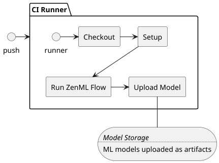
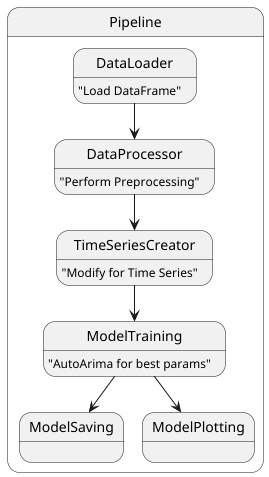

# Road Accidents in France
The road accident project for the NOV 24 DS course.
The project and the data sources consist of analyzing the road accidents that
happened in France from the year 2019 to current year.
The goals of the project broadly ask whether we can find such
patterns and can MDL help us recognize zones of France5 associated with the
most risk due to road accidents.
For this project we decided to use mostly mainland France and the years 2019 and
beyond.
We thus list out our main goals for each step of the project as follows:
+ Analyze the data and validate its purpose 
+ Filter and clean the data (Preprocessing)
+ Model the data to predict the severity
+ Create a Forecaster that can predict future accidents.
+ Calculate and visualize the Danger Zones

## Quick Streamlit
The Road Accident Streamlit App

[](https://french-road-accidents-fr4nc015.streamlit.app/)

## Project Organization

```
├── LICENSE            <- Open-source license if one is chosen
├── README.md          <- The top-level README for developers using this project.
├── data
│   └── input            <- The original, immutable data dump as parquet files
│
│
├── models             <- Trained and serialized models
│
├── notebooks          <- Jupyter notebooks. 
│
│
├── architecture         <- Architecture diagram and other UML diagrams
│
├── reports            <- Final Report stored as Road-Accident-NOV24-Francois-Report.
│   └── figures        <- Generated graphics and figures to be used in reporting
│
├── requirements.txt   <- The requirements file for reproducing the analysis environment, e.g.
│                         generated with `pip freeze > requirements.txt`
│
├── .streamlit         <- Streamlit config files
│
└── pages   <- Pages for streamlit app.
│
├── streamlit_Road_Accidents.py          <- Main entry point for streamlit app
│
│
└── src   <- Source code for use in this project.
    │
    ├── monolith.py             <- The steps for the zen ml pipeline
    │
    ├── utils.py               <- Store useful variables and utility funcs
    │
    ├── franums.py              <- Contains the RoadAccidentEnum for mappings of data
    │
│   
└──run-zenml.py          <- Main entry point for the CI Runner and local testing
```

--------

## How to Run code
### ML Modelling
Check out the notebooks and reports to understand the flow of the code. For a quick start
1. Install the ```requirements.txt``` with ```$ pip install -r requirements.txt```
2. Make sure the version numbers are correct. ```Pmdarima``` doesn't play well with some versions of `scipy & scikit-learn`
3. Run the code `run-zenml.py`. The entry point is the `main` method
4. Change the `maxiter` for deeper training.

### Streamlit App
Check out the `pages` folder to see all the pages for the streamlit app. For a quick start
1. Install the ```requirements.txt``` with ```$ pip install -r requirements.txt```
2. Run the code ```$ streamlit run streamlit_Road_Accidents.py``` 
3. Enjoy the magic


## CI/CD Runner
The CI runner is a self-hosted runner and will not work unless you configure your own runner.
The architecture diagram is seen below. The runner starts on a `push` to the develop branch, currently its only on develop
to avoid using the runner limits

###



## MLOps
ZenMl was selected as an MLOps engine due to its simple nature and ability to create local orchestration.
An alternative would have been Prefect , both fulfilling their roles.
ZenML allows us to create a `Pipeline` consisting of `steps` to break down the ML process into manaegable 
codes. See figure below for the `Pipeline` overview

###


## Neptune AI
The classifier pipleline runs have been logged to [](https://app.neptune.ai/o/France-Road-Accidents-Test/org/SeverityClassifier)
