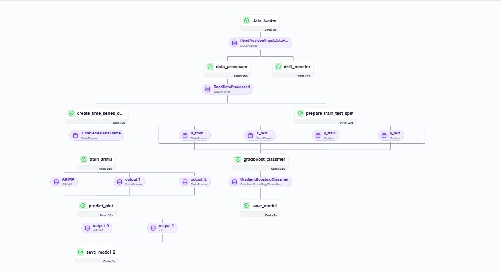
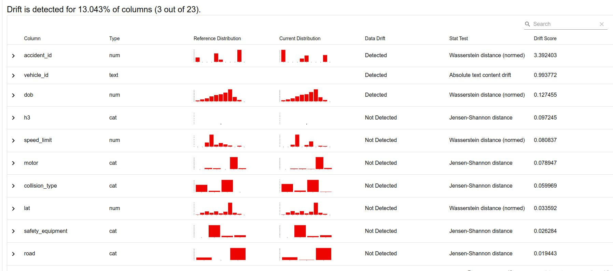

# Road Accidents in France Unified DecisionMaker
The road accident project for the NOV-Mar 24 DS/MLOps course.
The project and the data sources consist of analyzing the road accidents that
happened in France from the year 2019 to current year.
The goals of the project broadly ask whether we can find such
patterns and can MDL help us recognize zones of France5 associated with the
most risk due to road accidents.
For this project we decided to use mostly mainland France and the years 2019 and
beyond.
We divide our Project into 2 Main Parts 
1. DS Part
2. MLOps Part


#### DS Part:
The main goals for the DS part were as follows
+ Analyze the data and validate its purpose 
+ Filter and clean the data (Preprocessing)
+ Model the data to predict the severity
+ Create a Forecaster that can predict future accidents.
+ Calculate and visualize the Danger Zones

#### MLOps Part:
The Main goals for the MLOps part were as follows
+ Orchestrate the entire MLOps Training Part
+ Log the Data, Model & Experiments(Runs) and version them
+ Monitor the Data & Models for Drift
+ Provide an Inference Endpoint
+ Containerize the Inference system
+ Monitor the Inference system via Prometheus and Grafana DashBoards
+ Provide an Authentication System for __Admin__ Retraininng


#### NOTE:
The project uses a bunch of external tools which require __Authentication__ Tokens.
For eg (Mapbox, Neptune, Evidently) etc. These must be obtained separtely. Any tokens accidently left in the repo
will expire on the ~ 28 March 2025 and will not be renewed.

Ideally one can make a `.env` file and put the __API__ tokens there . See `python-dotenv` library and the `utils.py` file for more details.
Without the tokens , a lot of the runs will fail. Either remove the external tools or acquire _free_ tokens and save them.

## Quick Streamlit
The Road Accident Streamlit App located below.
__Note__ : Since streamlit is a free resource and since the 13k Euro DS course doesn't provide any resource, the instance
of the app may be down due to exhausting the Github lfs Bandwith.
You can ofcourse run it locally with 

`$ streamlit run streamlit_Road_Accidents.py`
###
[](https://french-road-accidents-fr4nc015.streamlit.app/)

## Project Organization

```
├── LICENSE            <- Open-source license if one is chosen
├── README.md          <- The top-level README for developers using this project.
├── data
│   └── input            <- The original, immutable data dump as parquet files
│
├── app/                    <- Inference Service App
│   ├── main.py            <- Main FastAPI service implementation
│   └── prometheus/
│       └── prometheus.yml <- Prometheus service configuration
    ├── grafana/
           ├── dashboards/
    │      │   └── fastapi_dashboard.json <- Grafana dashboard Visualization confs
    │      └── datasources/
    │             └── datasources.yml      <- Grafana data source configs
    │ 
    ├── Dockerfile_app          <- FastAPI application container definitonns
    ├── requirements.txt        <- App only requirements.txt
    ├── docker-compose.yml      <- Container orchestration configs
    ├── fast_api_test.py        <- FastAPI service pytests
    ├── docker_1_test.py        <- Client simulation
    └── Dockerfile_docker_1     <- Client container docker defn

│
├── models             <- Trained and serialized models
│
├── notebooks          <- Jupyter notebooks. 
│
│
├── architecture         <- Architecture diagram and other UML diagrams
│
├── reports            <- Final Report stored as Road-Accident-NOV24-Francois-Report.
│   └── figures        <- Generated graphics and figures to be used in reporting
│
├── requirements.txt   <- The requirements file for reproducing the analysis environment, e.g.
│                         generated with `pip freeze > requirements.txt`
│
├── .streamlit         <- Streamlit config files
│
└── pages   <- Pages for streamlit app.
│
├── streamlit_Road_Accidents.py          <- Main entry point for streamlit app
│
│
└── src   <- Source code for use in this project.
    │
    ├── common_monolith.py             <- Common steps for the ZenMl pipeline
    ├── forecast_monolith.py                 <- The steps for the Time Series Pipeline
    ├── classifier_monolith.py                 <- The steps for the Classifier ZenMl pipeline
    │
    ├── utils.py                    <- Store useful variables and utility funcs . Also contains defns for `env` variables
    │
    ├── franums.py                  <- Contains the RoadAccidentEnum for mappings of data
    │
│   
└──run-zenml.py          <- Main entry point for the CI Runner and local testing
```

--------

## How to Run code
### ML Modelling
Check out the notebooks and reports to understand the flow of the code. For a quick start
1. Install the ```requirements.txt``` with ```$ pip install -r requirements.txt```
2. Make sure the version numbers are correct. ```Pmdarima``` doesn't play well with some versions of `scipy & scikit-learn`
3. Run the code `run-zenml.py`. The entry point is the `main` method
4. Change the `maxiter` for deeper training.

### Streamlit App
Check out the `pages` folder to see all the pages for the streamlit app. For a quick start
1. Install the ```requirements.txt``` with ```$ pip install -r requirements.txt```
2. Run the code ```$ streamlit run streamlit_Road_Accidents.py``` 
3. Enjoy the magic


## CI/CD Runner
The CI runner is a self-hosted runner and will not work unless you configure your own runner.
The architecture diagram is seen below. The runner starts on a `push` to the develop branch, currently its only on develop
to avoid using the runner limits

###


## MLOps
ZenMl was selected as an MLOps engine due to its simple nature and ability to create local orchestration.
An alternative would have been Prefect , both fulfilling their roles.
ZenML allows us to create a `Pipeline` consisting of `steps` to break down the ML process into manaegable 
codes. See figure below for the `Pipeline` overview

###

####
The `ZenMl Local Pipeline` as seen below is a snapshot of a local pipeline with `Debug` values . For the real pipeline , one needs to logon to the `ci runner` and see the pipeline  


## Monitoring Tools
+ The classifier pipleline runs have been logged to [Severity Classifier NeptuneAI](https://app.neptune.ai/o/France-Road-Accidents-Test/org/SeverityClassifier)
+ The Time Series Pipeline runs have been logged to [RoadAccidentForecast](https://app.neptune.ai/o/fdevi3-time/org/RoadAcccidentForecast)
+ Data Drift (although unnecessary) are logged on to `Evidently` (see snapshot below)

####

