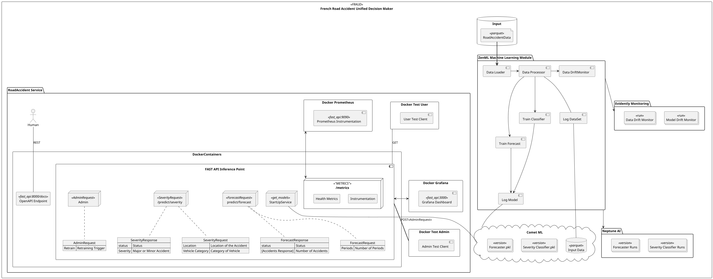
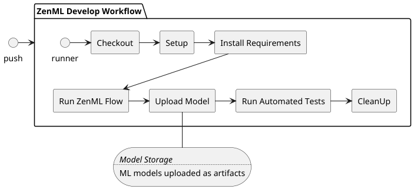
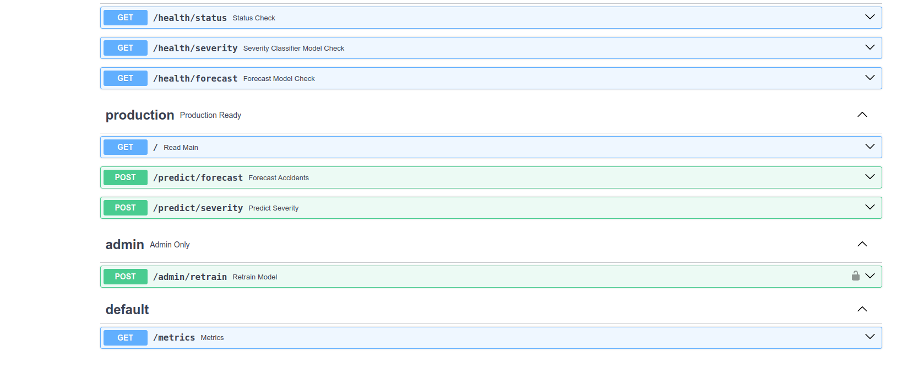
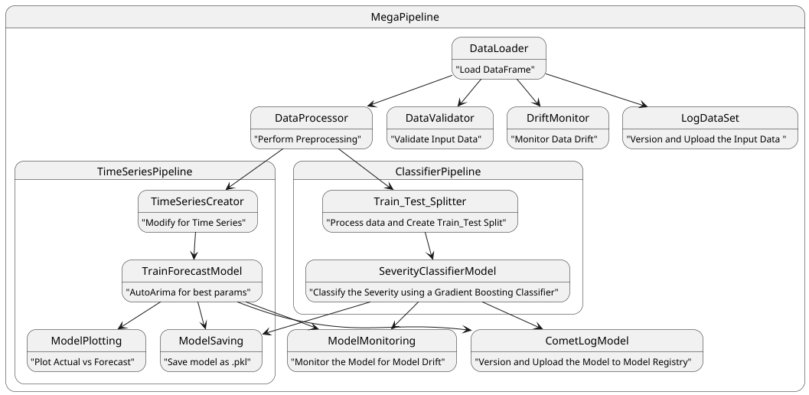
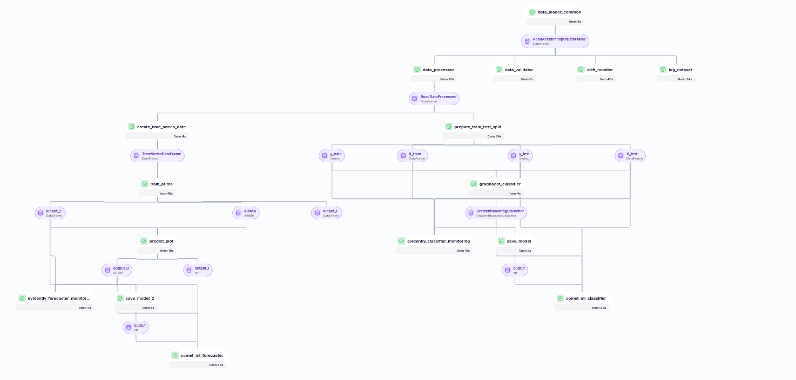

# Road Accidents in France Unified DecisionMaker
As part of the Nov/March DS/MLE/MLOps DataScientets(DS) Bootcamp I needed to make a project , I present DS is _French Road Accidents Unified Decisionmaker_. 
The project and the data sources consist of analyzing the road accidents that
happened in France from the year 2019 to current year.
The goals of the project broadly ask whether we can find such
patterns and can MDL help us recognize zones of France5 associated with the
most risk due to road accidents.
For this project we decided to use mostly mainland France and the years 2019 and
beyond.
We divide our Project into 2 Main Parts 
1. DS Part
2. MLOps Part

#### DS Part:
The main goals for the DS part were as follows
+ Analyze the data and validate its purpose 
+ Filter and clean the data (Preprocessing)
+ Model the data to predict the severity
+ Create a Forecaster that can predict future accidents.
+ Calculate and visualize the Danger Zones

#### MLOps Part:
The Main goals for the MLOps part were as follows
+ Orchestrate the entire MLOps Training Part
+ Log the Data, Model & Experiments(Runs) and version them
+ Monitor the Data & Models for Drift
+ Provide an Inference Endpoint
+ Containerize the Inference system
+ Monitor the Inference system via Prometheus and Grafana DashBoards
+ Provide an Authentication System for __Admin__ Retraining


#### NOTE:
The project uses a bunch of external tools which require __Authentication__ Tokens.
For eg (Mapbox, Neptune, Evidently) etc. These must be obtained separately. Any tokens accidentally left in the repo
will expire on the ~ 28 March 2025 and will not be renewed.

Ideally one can make a `.env` file and put the __API__ tokens there . See `python-dotenv` library and the `utils.py` file for more details.
Without the tokens , a lot of the runs will fail. Either remove the external tools or acquire _free_ tokens and save them.

## Quick Streamlit
The Road Accident Streamlit App located below.
__Note__ : Since streamlit is a free resource and since the 13k Euro DS course doesn't provide any resource, the instance
of the app may be down due to exhausting the GitHub lfs Bandwidth.
You can ofcourse run it locally with 

`$ streamlit run streamlit_Road_Accidents.py`
###
[](https://french-road-accidents-fr4nc015.streamlit.app/)

---
## Architecture Diagram:
The _French Road Accident Unified Decisionmaker_ project architecture is seen below.
As mentioned it is broadly divided into 2 parts
1. Training aka DS Part
2. Inference aka MLOps Part



___

## Project Organization

```
├── LICENSE            <- Open-source license if one is chosen
├── README.md          <- The top-level README for developers using this project.
├── data
│   └── input            <- The original, immutable data dump as parquet files
│
├── app/                    <- Inference Service App
│   ├── main.py            <- Main FastAPI service implementation
│   └── prometheus/
│       └── prometheus.yml <- Prometheus service configuration
    ├── grafana/
           ├── dashboards/
    │      │   └── fastapi_dashboard.json <- Grafana dashboard Visualization confs
    │      └── datasources/
    │             └── datasources.yml      <- Grafana data source configs
    │ 
    ├── Dockerfile_app          <- FastAPI application container definitonns
    ├── requirements.txt        <- App only requirements.txt
    ├── docker-compose.yml      <- Container orchestration configs
    ├── fast_api_test.py        <- FastAPI service pytests
    ├── docker_1_test.py        <- Client simulation
    └── Dockerfile_docker_1     <- Client container docker defn

│
├── models             <- Trained and serialized models
│
├── notebooks          <- Jupyter notebooks. 
│
│
├── architecture         <- Architecture diagram and other UML diagrams
│
├── reports            <- Final Report stored as Road-Accident-NOV24-Francois-Report.
│   └── figures        <- Generated graphics and figures to be used in reporting
│
├── requirements.txt   <- The requirements file for reproducing the analysis environment, e.g.
│                         generated with `pip freeze > requirements.txt`
│
├── .streamlit         <- Streamlit config files
│
└── pages   <- Pages for streamlit app.
│
├── streamlit_Road_Accidents.py          <- Main entry point for streamlit app
│
└── tests                               <- Automated tests
    │
    ├── validation_test.py             <- Validate the input data with Pandera (Schema) # Overkill
│
│
└── src   <- Source code for use in this project.
    │
    ├── common_monolith.py             <- Common steps for the ZenMl pipeline
    ├── forecast_monolith.py                 <- The steps for the Time Series Pipeline
    ├── classifier_monolith.py                 <- The steps for the Classifier ZenMl pipeline
    │
    ├── utils.py                    <- Store useful variables and utility funcs . Also contains defns for `env` variables
    │
    ├── franums.py                  <- Contains the RoadAccidentEnum for mappings of data
    │
│   
└──run-zenml.py          <- Main entry point for the CI Runner and local testing
```

--------

## How to Run code
### DS Part 
####  __ML Modelling__:

Check out the notebooks and reports to understand the flow of the code. For a quick start
1. Install the ```requirements.txt``` with ```$ pip install -r requirements.txt```
2. Make sure the version numbers are correct. ```Pmdarima``` doesn't play well with some versions of `scipy & scikit-learn`
3. Run the code `run-zenml.py`. The entry point is the `main` method
4. Change the `maxiter` of the _Time Series Model_ for deeper training.
5. Change `params` of the _Classifier Model_ for deeper training

####  __Streamlit App__:
Check out the `pages` folder to see all the pages for the streamlit app. For a quick start
1. Install the ```requirements.txt``` with ```$ pip install -r requirements.txt```
2. Run the code ```$ streamlit run streamlit_Road_Accidents.py``` 
3. Enjoy the magic


####  __CI/CD__:
The CI runner is a self-hosted runner(running on DS cheap EC2 instance) and will not work unless you configure your own runner.
The architecture diagram is seen below. The runner starts on a `push` to the develop branch, currently it's only on develop
to avoid using the runner limits.

The runner needs >> 5GB of space (ideally one doesn't worry about space but a 13k course can't provide it , so hence the warning).

_Note_ : To make changes edit the `develop_worflow.yml` file in the `.github/workdlow` folder. 
Add or subtract stages as needed.
If using a cheap EC2 instance note the timeout (ideally one doesn't worry about timeouts either but hey :P)
###



### MLOps Part
####  __Inference Service App__:
1. Navigate to the `app` folder
2. Make sure `fastapi[standard]` is installed . If not use the `uvicorn` command instead.
3. Launch the __FastAPI__ service instance by `$ fastapi dev main.py` (Dev/Run) both work
4. Open the browser to the `xxxx:yyyy/docs` to see the endpoint _docs_ (See image below)
####


####

####  __Prometheus & Grafana__:
1. Prometheus metrics are done via  `prometheus_fastapi_instrumentator` which exposes the _Inference App_ to be scrapped.
2. Add Custom Metrics either via `prometheus_client` _Metrics_ or see `prometheus_fastapi_instrumentator` docs for custom metrics.
3. Edit the ports if needed. See both `docker-compose.yml` and `.yml` files in the respective prometheus and grafana folders for configs.

####  __Launching the Service__:
1. Build the `services` via `$ docker-compose build` command from the `app` folder.
2. On successfully build , launch the services via `$ docker-compose up`
3. `fast_api` should be on `xxxxx:8000/docs`
4. `grafana` should be on `xxxx:3000` . Login with `admin` as both username and password
5. `prometheus` should be on `xxxx:9090` 
6. `xxxx` refers to either `localhost` or `test_network` address. Ideally for local testing it lands on `localhost`

####  __Test the Inference Service__:
1. If you want to run all _Unit Tests_ , navigate to root project folder and run `$ pythom -m pytest`
2. If you want to test the _Inference Service App_ only navigate to `app` folder and run `$ python -m pytest`
3. There are 2 Clients which simulate `user` and `admin` . They periodically ping the _Inference Service_ with requests. Edit if needed.
4. One can also test it out via launching the inference service and then making requests at `xxxx:8000/docs` (see Fast_API image above)


## Tools Used
####  __Pipeline Orchestration__:
ZenML was selected as an MLOps orchestrator engine due to its simple nature and ability to create local orchestration.
An alternative would have been Prefect , both fulfilling their roles.
ZenML allows us to create a `Pipeline` consisting of `steps` to break down the ML process into manageable 
codes. See figure below for the `Pipeline` overview

###

####
The `ZenMl Local Pipeline` as seen below is a snapshot of a local pipeline with `Debug` values . For the real pipeline , one needs to log on to the `ci runner` and see the pipeline  


####  __Monitoring Tools__:
1. Drift and Model Monitoring : [Evidently](https://www.evidentlyai.com/)
2. Experiment Runs : [Neptune AI](https://neptune.ai/)
   + The classifier pipeline runs have been logged to [Severity Classifier NeptuneAI](https://app.neptune.ai/o/France-Road-Accidents-Test/org/SeverityClassifier)
   + The Time Series Pipeline runs have been logged to [RoadAccidentForecast](https://app.neptune.ai/o/fdevi3-time/org/RoadAcccidentForecast)
3. Artifact Store : ZenML has its own artifact store but was not accepted by DS hence [CometML](https://www.comet.com/)
    + Data Store : Input Data is versioned and logged to the CometML Registry
    + Model Store : Models created by pipeline runs are automatically tagged, versioned and uploaded to the CometML Model Registry
4. Schema Validation : [Pandera](https://pandera.readthedocs.io/en/stable/)

####  __Inference Service__:
1. [FastAPI](https://fastapi.tiangolo.com/) : The best _docs_ and _package_ I've seen.  _Tip_: skip the DS course and use _package_ docs.
2. Grafana
3. Prometheus
4. Docker Containers
5. Pytests : For testing

Anything I've missed , you can take a look at the code and or `streamlit pages`.
Code still has some work , but it was done in ~ 3 weeks . You can definitely take some inspiration and code :) .
Check out [Awesome Mega Library](https://github.com/sindresorhus/awesome) for awesome lists on actual Machine Learning and DataScience.

Have Fun & Thanks for all the Fish !
